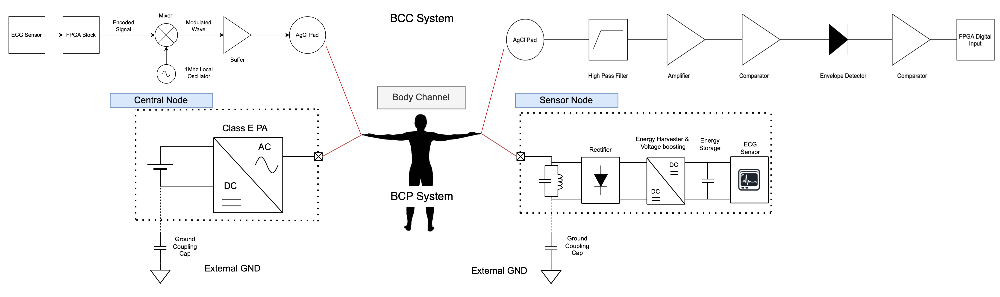

# ban-prototype

This project is an Undergrad Research Project with NUS under A/Prof Jerald Yoo (currently drafting a paper submission to TBioCAS). We developed the first Body Area Network (BAN) system in which Body-Coupled Powering (BCP) and Body-Coupled Communication (BCC) were implemented together in a single system. 

In the video below, the Central Node (near the hand) wirelessly transmits power through the arm to charge a Sensor Node (near the chest), which powers an ECG sensor. The recorded ECG data is then transmitted through the arm to the Central Node, which sends the data for display on the computer. 

https://user-images.githubusercontent.com/59247141/186712875-12e1bca3-517a-4aa3-9227-2e6ee5e8f304.mp4

This repository consists of the circuit design and PCB files, as well as the verilog code that was implemented on the microcontrollers (FPGA) in the Central and Sensor nodes.

## Circuit Design

The BAN system consists of a Power Transmitter and a Data Receiver on the Central Node, and the Power Receiver and Data Transmitter on the Sensor Node. The full System Diagram is as shown below:

The "pcb_files" folder contains the schematics (under Project Outputs) of the Central and Sensor Node prototype circuit boards. The final prototypes are as shown below:

## System Logic

The system logic is implemented on 2 FPGAs, one on each node. The full verilog code for each node can be accessed in their respective folders.